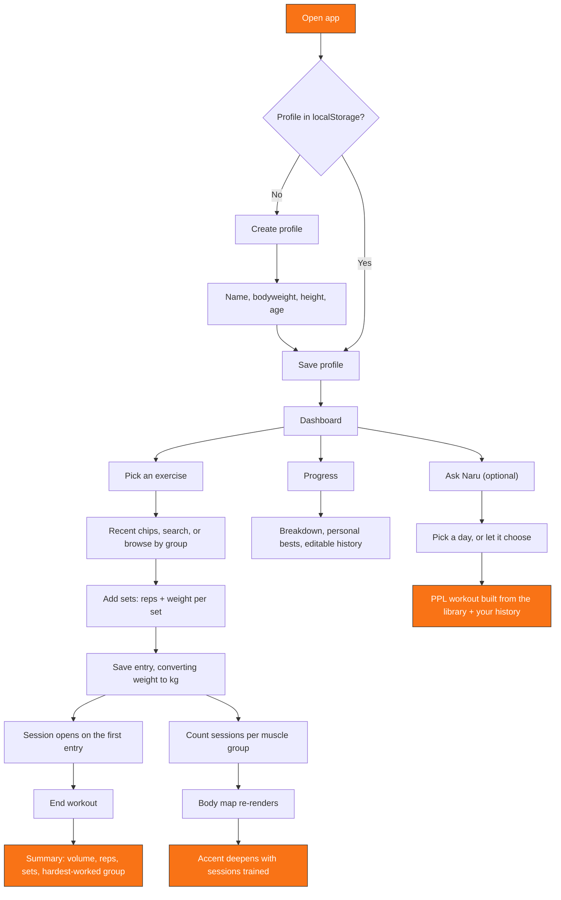

# 🏋️ Workout Tracker - Tsyoku-Naru


A workout logger that shows you what you've actually trained. Create a profile,
log each set with its own reps and weight, and watch an anatomical body map —
front and back — shade in for every muscle group you work. End a session to get
a breakdown of what you moved.

Everything is stored in your browser. No account, no backend.

**🔗 Live demo:** [tsyoku-naru.netlify.app](https://tsyoku-naru.netlify.app/)

---

## Table of Contents

- [Features](#features)
- [Tech Stack](#tech-stack)
- [How It Works](#how-it-works)
- [Getting Started](#getting-started)
- [Roadmap](#roadmap)
- [License](#license)

---

## Features

- **Per-set logging** — every set carries its own reps and weight, so a warmup
  ramp (10 × 60, 8 × 80, 6 × 85) is recorded as what it was rather than averaged
  into one line
- **157-movement exercise library** across seven muscle groups, with recent
  movements one tap away and search across the whole library when it isn't one
  of those
- **Anatomical body map** — front and back views that shade from a neutral base
  toward full accent as sessions accumulate for each muscle group
- **Workout sessions** — a session opens with your first entry and runs until you
  end it, then summarises total weight moved, reps, sets, time under tension and
  the muscle group that took the most work
- **kg or lb** — enter in either; kilograms are stored internally so switching
  units never rewrites your history
- **Editable history** — open any past entry to correct a set or delete it, with
  volume, personal bests and the body map following along
- **Progress view** — sessions per muscle group, personal bests, and full history
- **Compare page** — weekly session counts for every profile in this browser
- **Naru** — an optional coach in the dashboard's corner. Ask it to build today's
  session and it puts together a Push/Pull/Legs workout from the exercise
  library, either a day you pick or one it picks by rotating off your last
  logged session. Runs entirely client-side — no API key, no network call
- **Dark and light themes**, and a first-run walkthrough

## Tech Stack

| Layer | Technology |
|---|---|
| UI | [React 19](https://react.dev/) |
| Routing | [React Router](https://reactrouter.com/) |
| Build | [Vite](https://vite.dev/) |
| Styling | CSS custom properties, one global stylesheet |
| Animation | [Motion](https://motion.dev/) |
| Data persistence | Browser `localStorage` |
| Hosting | Netlify |

Fully client-side — no backend, no database. Profiles and logs are read from and
written to `localStorage`, which keeps the app fast and free to host, and means
your data is per-browser and never leaves your machine.

## How It Works



**In short:** each entry is tagged to one muscle group → the body map shades by
how many sessions that group has → volume totals are summed from the individual
sets → ending a workout summarises the session.

Two details worth knowing:

- **Body map shading tracks how many sessions** a group has, not how much volume.
  Five sessions saturates it.
- **Timed work is excluded from rep and volume totals.** A plank is recorded in
  seconds; seconds don't convert to reps or kilograms.

## Getting Started

This is a Vite project, so it needs a build step — opening `index.html` directly
won't work.

```bash
git clone https://github.com/byjoelsamuel/workout-tracker.git
cd workout-tracker
npm install
npm run dev
```

Then open the URL Vite prints (usually `http://localhost:5173`).

```bash
npm run build    # production build into dist/
npm run preview  # serve the built output
```

## Roadmap

- [ ] Export/import profile data (JSON backup)
- [ ] Rest timer between sets
- [ ] Prefill a movement's sets from last time
- [ ] Workout templates and supersets
- [ ] Optional cloud sync for cross-device access

## Credits

Body map geometry is derived from
[react-body-highlighter](https://github.com/giavinh79/react-body-highlighter)
(MIT). See [`THIRD-PARTY.md`](THIRD-PARTY.md).

## License

Distributed under the MIT License. See `LICENSE` for details.

---

Built by [Joel Samuel](https://github.com/byjoelsamuel)
