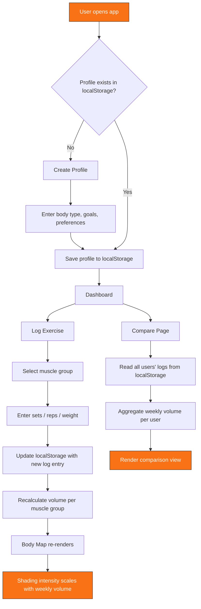

# 🏋️ Workout Tracker - Tsyoku-Naru


A personalized workout tracker that logs and suggests workouts based on your body type, goals, and preferences. Create a profile, log exercises by muscle group, and watch a front-view body map shade in as training volume builds up for each muscle group over the week — then compare your training against everyone else on the Compare page.

**🔗 Live demo:** [tsyoku-naru.netlify.app](https://tsyoku-naru.netlify.app/)

---

## Table of Contents

- [Features](#features)
- [Tech Stack](#tech-stack)
- [How It Works](#how-it-works)
- [Getting Started](#getting-started)
- [Roadmap](#roadmap)
- [License](#license)

---

## Features

- **Profile creation** — set up a personal profile with body type, goals, and training preferences
- **Exercise logging by muscle group** — log sets/reps and tag each exercise to the muscle group it trains
- **Visual body map** — an interactive front-view body diagram that shades in (color intensity scales with volume) as you log more training for each muscle group
- **Workout suggestions** — recommendations generated from your body type, goals, and preferences
- **Compare page** — see how your weekly training volume stacks up against other users
- **Persistent local storage** — your profile and logs are saved directly in the browser, no account or backend required

## Tech Stack

| Layer | Technology |
|---|---|
| Structure | HTML5 |
| Styling | CSS3 |
| Logic | JavaScript (vanilla) |
| Animation | [Motion](https://motion.dev/) |
| Data persistence | Browser `localStorage` |
| Hosting | Netlify |

This is a fully client-side application — there's no backend or database. All profile data, exercise logs, and comparison data are read from and written to `localStorage` in the browser, which keeps the app lightweight, fast, and free to host.

## How It Works

The diagram below walks through the core data flow, from creating a profile to seeing your body map update.



**In short:** every exercise you log is tagged to a muscle group → that updates a running volume total in `localStorage` → the body map component reads that total and re-renders with proportional shading → the Compare page reads across stored profiles to show relative training volume.

## Getting Started

Clone the repo and open it locally — no build step or backend setup required since everything runs client-side.

```bash
git clone https://github.com/byjoelsamuel/workout-tracker.git
cd workout-tracker
```

Then open `index.html` in your browser, or serve it with a lightweight local server:

```bash
npx serve .
```

## Roadmap

- [ ] Export/import profile data (JSON backup)
- [ ] Optional cloud sync for cross-device access
- [ ] Expanded exercise library with muscle-group presets
- [ ] Mobile-first responsive polish

## License

Distributed under the MIT License. See `LICENSE` for details.

---

Built by [Joel Samuel](https://github.com/byjoelsamuel)
