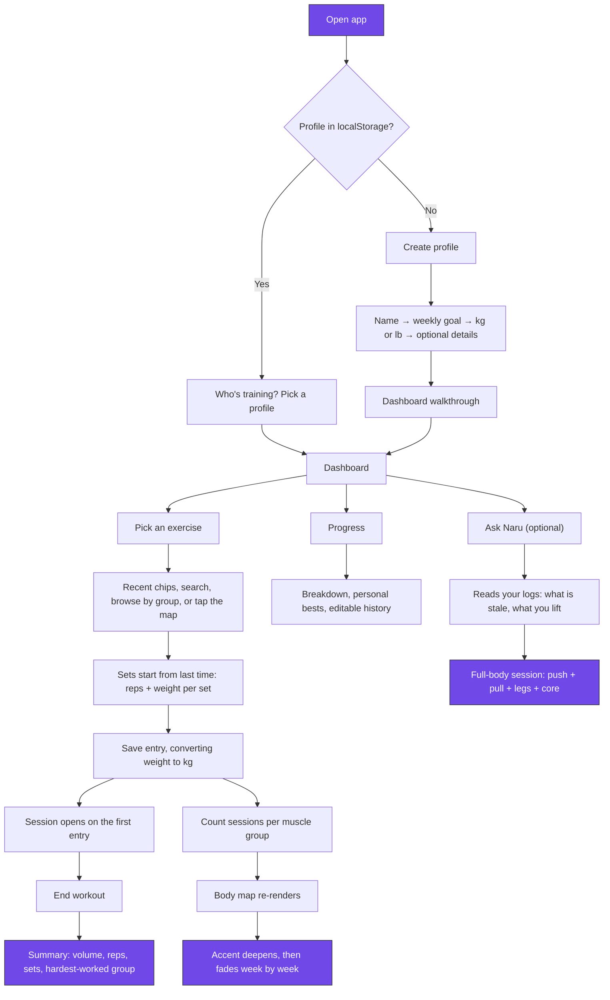

# 🏋️ Workout Tracker - Tsyoku-Naru


A workout logger that shows you what you've actually trained. Create a profile,
log each set with its own reps and weight, and watch an anatomical body map —
front and back — shade in for every muscle group you work. End a session to get
a breakdown of what you moved.

Everything is stored on your device. No account, no backend.

**🔗 Live demo:**
[workout-tracker-alpha-two-23.vercel.app](https://workout-tracker-alpha-two-23.vercel.app/)
— hosted on Vercel, deployed from `main`.

**💻 Desktop app:** Windows 11 and Fedora —
[download from the latest release](https://github.com/byjoelsamuel/workout-tracker/releases/latest).

> **Prefer the Vercel link above.** The old Netlify deploy at
> [tsyoku-naru.netlify.app](https://tsyoku-naru.netlify.app/) is **out of date** —
> its auto-deploy stopped running and it is several releases behind, so it is
> missing the weekly goal, the decaying body map and the set steppers. It is kept
> only as a fallback while the move settles.

---

## Table of Contents

- [Features](#features)
- [Desktop App](#desktop-app)
- [Tech Stack](#tech-stack)
- [How It Works](#how-it-works)
- [Getting Started](#getting-started)
- [Roadmap](#roadmap)
- [License](#license)

---

## Features

- **Profile sign-in and guided setup** — a "Who's training?" screen lists every
  profile in this browser. New profiles are set up one question at a time:
  name, weekly goal, kg or lb, and optional body details, with each answer
  checked as you go
- **Walkthrough on first visit** — a short spotlight tour of the dashboard that
  you can step through with the arrow keys, skip, or replay from Settings
- **Per-set logging** — every set carries its own reps and weight, so a warmup
  ramp (10 × 60, 8 × 80, 6 × 85) is recorded as what it was rather than averaged
  into one line. A movement you've done before starts from last session's sets,
  with your best shown alongside
- **Undo, personal bests and a rest timer** — every log can be undone from the
  confirmation that appears; beating your best set is called out as it happens;
  a rest timer starts after each log (±30s or skip)
- **157-movement exercise library** across seven muscle groups, with recent
  movements one tap away, search with arrow-key selection (press `/` to jump
  to it), and browsing by muscle group — or tap a muscle on the body map
- **Anatomical body map** — front and back views that shade toward full accent
  for the muscle groups you have worked *lately*. Heat decays with a one-week
  half-life rather than piling up forever, so the figure keeps saying something
  once you have months of history behind you
- **Weekly goal** — a Mon–Sun target you set yourself, with a streak counting
  consecutive weeks trained (not weeks that hit the goal, so raising the target
  never erases your history)
- **Workout sessions** — a session opens with your first entry and runs until you
  end it, then summarises total weight moved, reps, sets, time under tension and
  the muscle group that took the most work
- **kg or lb** — enter in either; kilograms are stored internally so switching
  units never rewrites your history
- **Editable history** — open any past entry to correct a set or delete it, with
  volume, personal bests and the body map following along
- **Progress view** — lifetime sessions per muscle group with how long since
  each was last trained, personal bests, and full history
- **Compare page** — weekly workout counts for every profile in this browser
- **Naru** — an optional planner, opened from "Plan with Naru" on the dashboard.
  It reads your logs and lays out a *full-body* session: one push, one pull and
  one leg compound, plus accessories aimed at whatever your body map says has
  gone stalest, and core. Starting weights come from your own best sets, backed
  off ~10% and rounded to real plates. Each movement has a **Log** button that
  drops it into the log form and ticks itself off. Deterministic and entirely
  client-side — no API key, no network call, no model
- **Settings** — edit your profile, units, rest-timer length, theme (system,
  light or dark), turn Naru on or off, replay the walkthrough, and delete a
  profile
- **Backup** — export every profile to a JSON file and import it into another
  browser. Importing only adds what's missing; nothing already there is
  overwritten
- **Dark and light themes**, keyboard-friendly dialogs (focus is trapped and
  returned, Escape closes), and reduced-motion support throughout

## Desktop App

The same app in its own window, for **Windows 11** and **Fedora**. It opens
straight to your dashboard and works with no internet connection.

Download from the [latest release](https://github.com/byjoelsamuel/workout-tracker/releases/latest):

| System | File | Install |
|---|---|---|
| Windows 11 | `Tsyoku-naru-Setup-x64.exe` | Run it. The installer isn't code-signed, so Windows may say "Windows protected your PC" — choose **More info → Run anyway**. |
| Fedora | `Tsyoku-naru-x86_64.rpm` | `sudo dnf install ./Tsyoku-naru-x86_64.rpm`, then open Tsyoku-naru from Activities. |
| Other Linux | `Tsyoku-naru-x86_64.AppImage` | `chmod +x` it and run. Needs FUSE 2 (`sudo dnf install fuse-libs` on Fedora). |

The app keeps its own history, separate from the website's. To move yours
across, use **Settings → Backup → Export** on the website and **Import** in the
app (or the other way round). Uninstalling the app keeps your data.

## Tech Stack

| Layer | Technology |
|---|---|
| UI | [React 19](https://react.dev/) |
| Routing | [React Router](https://reactrouter.com/) |
| Build | [Vite](https://vite.dev/) |
| Styling | CSS custom properties, one global stylesheet |
| Animation | [Motion](https://motion.dev/) |
| Data persistence | Browser `localStorage` |
| Desktop | [Electron](https://www.electronjs.org/) + [electron-builder](https://www.electron.build/) (`electron-builder.yml`), built and released by GitHub Actions |
| Hosting | [Vercel](https://vercel.com/) (`vercel.json`) — Netlify config kept as a fallback |

Fully client-side — no backend, no database. Profiles and logs are read from and
written to `localStorage`, which keeps the app fast and free to host, and means
your data is per-browser and never leaves your machine.

## How It Works


```mermaid
flowchart TD
    A[Open app] --> B{Profile in localStorage?}
    B -- No --> C[Create profile]
    C --> C1["Name → weekly goal → kg or lb → optional details"]
    C1 --> D[Dashboard walkthrough]
    B -- Yes --> B1["Who's training? Pick a profile"]
    B1 --> E
    D --> E

    E[Dashboard] --> F[Pick an exercise]
    F --> F1["Recent chips, search, browse by group, or tap the map"]
    F1 --> F2["Sets start from last time: reps + weight per set"]
    F2 --> G[Save entry, converting weight to kg]
    G --> G1[Session opens on the first entry]

    G --> H[Count sessions per muscle group]
    H --> I[Body map re-renders]
    I --> I1[Accent deepens, then fades week by week]

    G1 --> L[End workout]
    L --> L1[Summary: volume, reps, sets, hardest-worked group]

    E --> M[Progress]
    M --> M1[Breakdown, personal bests, editable history]

    E --> N["Ask Naru (optional)"]
    N --> N1[Reads your logs: what is stale, what you lift]
    N1 --> N2[Full-body session: push + pull + legs + core]

    style A fill:#7048e8,stroke:#333,color:#fff
    style I1 fill:#7048e8,stroke:#333,color:#fff
    style L1 fill:#7048e8,stroke:#333,color:#fff
    style N2 fill:#7048e8,stroke:#333,color:#fff
```

**In short:** each entry is tagged to one muscle group → the body map shades by
how many sessions that group has → volume totals are summed from the individual
sets → ending a workout summarises the session.

Two details worth knowing:

- **Body map shading tracks recent sessions, and fades.** A session counts
  fully the day it is logged and halves every week after, so the figure shows
  what you have trained lately rather than everything you have ever done.
- **Timed work is excluded from rep and volume totals.** A plank is recorded in
  seconds; seconds don't convert to reps or kilograms.

## Getting Started

This is a Vite project, so it needs a build step — opening `index.html` directly
won't work.

```bash
git clone https://github.com/byjoelsamuel/workout-tracker.git
cd workout-tracker
npm install
npm run dev
```

Then open the URL Vite prints (usually `http://localhost:5173`).

```bash
npm run build    # production build into dist/
npm run preview  # serve the built output
```

### Desktop app

```bash
npm run desktop     # build, then open the app in an Electron window
npm run dist:linux  # Fedora .rpm + AppImage into release/ (needs `rpm` installed)
npm run dist:win    # Windows installer into release/ (run on Windows)
```

Releases are built by GitHub Actions (`.github/workflows/desktop.yml`). To
publish one, **bump `version` in `package.json` and merge to `main`** — when
`main` carries a version that has no release yet, the workflow builds the
Windows installer on Windows and the Linux packages on Ubuntu, creates the
`v<version>` tag, and attaches all three to a GitHub Release. Merges that don't
change the version publish nothing.

Pushing a tag by hand (`git tag v1.2.0 && git push origin v1.2.0`) also works,
as long as it matches `package.json`. Pull requests build the installers too,
as downloadable workflow artifacts, without publishing anything.

## Roadmap

- [x] Export/import profile data (JSON backup)
- [x] Rest timer between sets
- [x] Prefill a movement's sets from last time
- [x] Desktop app for Windows 11 and Fedora
- [ ] Move hosting back to Netlify
- [ ] Code-sign the Windows installer and add automatic updates
- [ ] Workout templates and supersets
- [ ] Optional cloud sync for cross-device access

## Credits

Body map geometry is derived from
[react-body-highlighter](https://github.com/giavinh79/react-body-highlighter)
(MIT). The typeface is [Rubik](https://github.com/googlefonts/rubik) (SIL Open
Font License). See [`THIRD-PARTY.md`](THIRD-PARTY.md).

## License

Distributed under the MIT License. See `LICENSE` for details.

---

Built by [Joel Samuel](https://github.com/byjoelsamuel)
